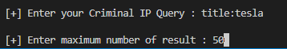
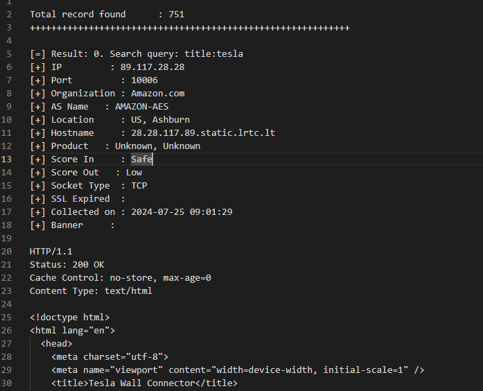

## Description
*Criminalip_👀* is a program that use the criminal IP banner search API to take your search queries and output the key data in a format so polished, it might just get a promotion. :sparkles:

## About
It uses the criminal IP banner search API to take your queries and print out search results with enough flair to make even your debugging sessions look stylish :smirk: 

## Prerequisites
Get Criminal IP API Key from criminalip.io

## Installation and Setup / Usage
Plug the API key you received into the CRIMINALIP_API_KEY variable in the criminalip_eyes.py file

## How to get started
Run the criminalip_eyes.py file, enter the query you want to search for, and *voilà*—your results will magically appear in the result.txt file. :fire:

## Screens

